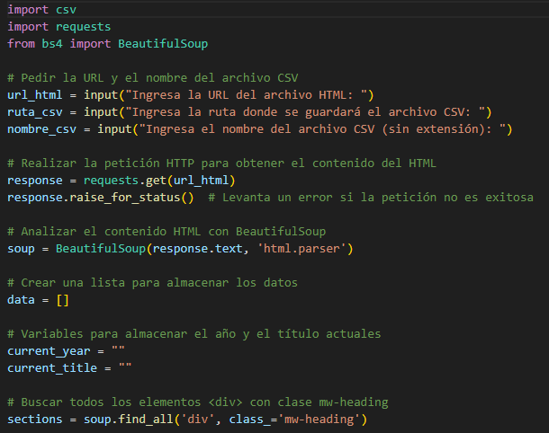
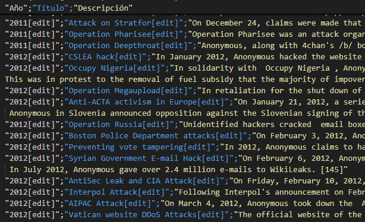
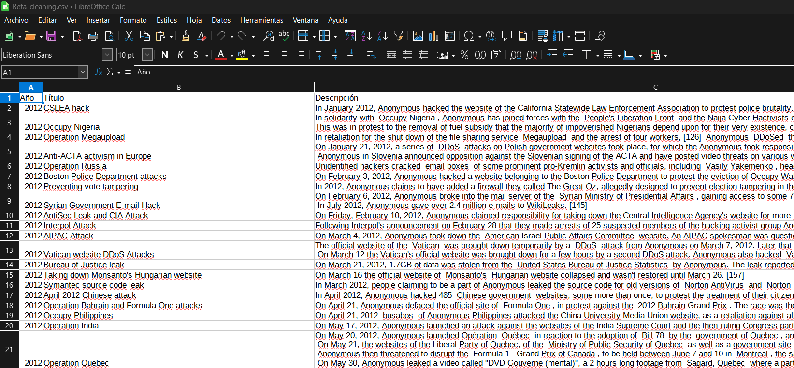
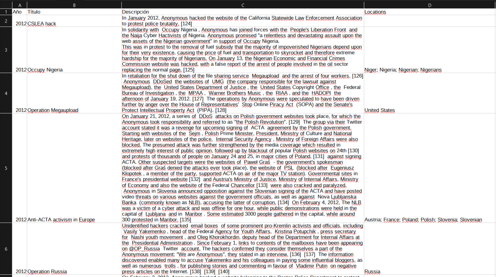
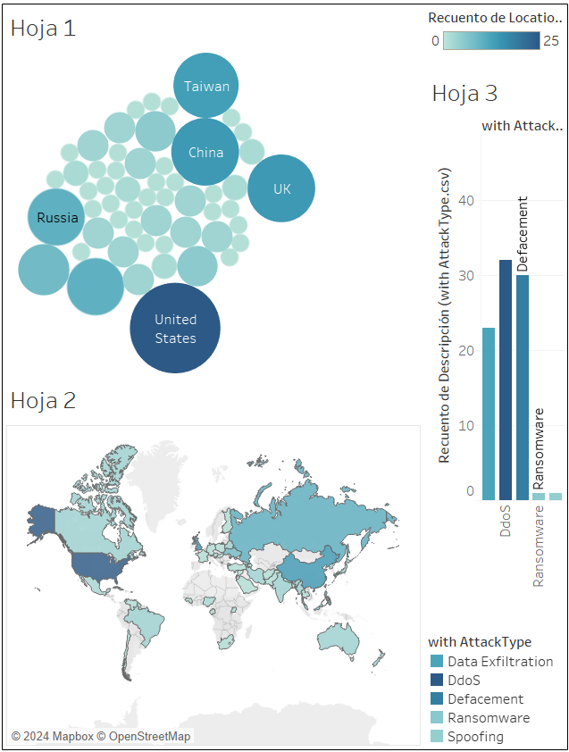

# Anonymous Report: 2012-2023 Attack Series

&nbsp;

# 1. Escenario

Una prestigiosa consultora de Ciberinteligencia (CTI) ha solicitado un informe de Data Analysis sobre los **ataques atribuidos al grupo hacker Anonymous** entre 2012 y 2023. Este análisis proporcionará una visión retrospectiva de las actividades del grupo y ayudará a identificar patrones, técnicas y objetivos preferidos.

Como analista de datos, mi tarea es sumergirme en esta década de actividad hacker, desentrañando la compleja red de operaciones de Anonymous. Debo recopilar, procesar y analizar datos de múltiples fuentes, buscando tendencias, anomalías y evoluciones en sus métodos de ataque. Este informe será crucial para que las organizaciones comprendan mejor las amenazas que enfrentan y puedan fortalecer sus defensas contra futuros ataques similares.

&nbsp;

# 2. Desarrollo del caso

Tras explorar diversas fuentes y recursos para obtener un buen contexto sobre el target a analizar, he podido encontrar una fuente apropiada de datos sobre los ataques relacionados con el grupo hacker Anonymous.

**Elementos e insights de interés:**

- Clasificación de los tipos de ataque
- Víctimas/Targets
- Números y métricas relativo a los ataques
- Identificar tendencias

&nbsp;
## Web Scraping.
&nbsp;
**Script en Python.** En primer lugar, he decidido obtener los datos desde mi fuente para poder limpiarlos, procesarlos y analizarlos, por lo que procedo a observar la estructura HTML de la página web que contiene los datos y procedo a desarrollar un script (Anon_wikiScraper.py) con el que sacar los datos organizados en un archivo csv que contiene la información de la fecha, el nombre y la descripción de los ataques, obteniendo tras ejecutar el script un **Primer resultado en csv** (Draft_AnonymousAttacks.csv)

&nbsp;
### *snippet de código del script web_scraper.py:*

&nbsp;

### *Captura del inicio del primer resultado en formato .csv:*

&nbsp;

## Data Wrangling.

&nbsp;

Para comenzar a limpiar y depurar los datos obtenidos con el web scraping, voy a manipular el archivo csv en un spreadsheet y a realizar los cambios pertinentes. 

- **Eliminación de datos fuera de rango.** Los datos obtenidos arrojan resultados fuera del rango de fechas en el que está interesado el cliente, por lo que el primer paso será eliminar del spreadsheet los datos anteriores a 2012.

- **Eliminación de caracteres sobrantes.** procedo a eliminar elementos sobrantes que no contienen información relevante si no elementos del código html. Para ellos utilizo herramientas del propio spreadsheet y también otro pequeño script en Python para eliminar elementos concretos (csv_cleaner.py)

&nbsp;

&nbsp;

- **Añadir columnas de interés**. Ahora que he eliminado los datos irrelevantes, procedo a añadir columnas nuevas con información importante para el estudio. He creado diccionarios en formato .txt con información geográfica y técnica sobre ciberataques y he programado otro script en Python (csv_columns.py) que se encarga de leer las lineas en estos diccionarios y añadir nuevas columnas a nuestro csv, en este caso Location y Attack Type

&nbsp;

&nbsp;

- **Limpiar resultado de modificaciones.** procedemos a eliminar duplicados y datos irrelevantes. Con el script splitter3.py separamos las entradas que tienen más de un elemento en la columna Locations en una fila por elemento, para luego eliminar manualmente duplicados y comprobar que no son distintos paises. Esto es para hacer que el archivo sea compatible en formato con lo que Tableau y PowerBI requieren para poder crear visualizaciones certeras.

&nbsp;

## Visualizacion de datos en PowerBI.

&nbsp;

&nbsp;

## Visualizacion de datos en Tableau.

&nbsp;

